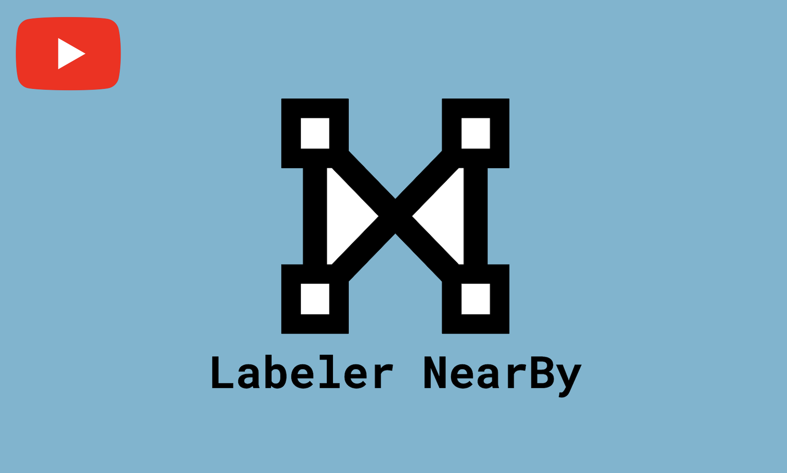

# Labeler NearBy
- Hackathon: [NEAR MetaBUILD III](https://metabuild.devpost.com/)
- Official Submission: https://devpost.com/software/labeler-nearby
- Submission Date: November 2023
- Authors:
  - Mehmet Yilmaz
  - Dylan Eck

## Description

A decentralized platform where machine learning researchers  can outsource data labeling to labelers around the world.

  

<em><strong>click the image to view the submission video (YouTube)</strong></em>

<em><strong>
⚠️ Note: Due to the small size of our team, we were not able to implement everything that we wanted to. Some things described in this write up are still a work in progress and as such may not be fully present in the code submitted
</strong></em>

## Inspiration

During my (Mehmet) time as an undergraduate I was competing in a competition called AgBot. The goal of the competition was to make a robot that could fertilize Maize plants as well as kill off any weeds around a Maize plant. The Maize plant is a plant that produced corn and in the competition these Maize plants were really early in their development phase. Ultimately, me and my team for that competition did not win that competition but well helping to develop the robot, I ran into an issue. I wanted to use machine learning and computer vision to train a model that could identify maize plants such that the robot could know where a Maize plant and/or weed plant was located in the real world. So I gathered over one thousand images of maize plants during their early development stage then quickly learned that I had to label all those images such that the model could learn from the data. The issue with this was that it was going to take a lot of time to do this and as a busy undergraduate in engineering, as well as bad procrastination habits, I never got the time to label those images and eventually never got to it. But I always wondered if there could be a service that labeled machine learning data for you but at a reasonable price.

A few years later, I discovered services like Scale AI and Amazon SageMaker Data Labeling that provided such a service. These companies are worth millions and/or billions by providing such a service. But my concern with these services was how they are all centralized which allows them to take a larger cut of the profit made by their service. Because of this, most likely, they provide a smaller return of the profit to the people who label that data in countries where lower pay is acceptable. So the idea of having a verison of Scale AI but decentralized was something I considered for a over two years but what stopped me from pursuing such a project was high transaction fees in popular cryptocurrencies like Ethereum and the fact that I did not really find anyone who attempted such a project.

That all changed with this hackathon, where I discovered NEAR. NEAR had low transaction fees and on top of that, there was a popular project called NEAR Crowd which gets tens of thousands of transactions a day which convinced me that this project of a decentralized data labeling platform would be possible. 

We were really inspired by the works of Scale AI and NEAR Crowd. Our desire for this hackathon was to solve some of the problems that we saw with these two existing services. The biggest problem that we see with Scale AI is that data laborers receive very little money for their work after Scale AI takes their cut of the revenue. Near is very similar to our project, however the usage of Near Crowd is limited due to its invite only nature.
## What it does and/or was suppose to do

The ultimate goal of this project is to provide an ecosystem for machine learning researchers to have their data labeled by labelers around the world. To achieve this goal, two tools are provided:
- ln-researcher: A tool for hosting data (just images for now)
- ln-labeler: A tool for labeling data.

To see the overall layout of this project, checkout the diagram [HERE](https://raw.githubusercontent.com/MehmetMHY/ln-researcher/main/assets/repoImgs/layout.png):

Ln-researcher (LNR) is what the researcher would use and consists of mainly four components:

- Researcher’s Smart Contract : This is a smart contract (sc) deployed by the researcher. This sc hosts jobs corresponding to images the researcher wants labeled. The labeler will use this sc to determine what image they will label. When requesting jobs from the sc, labelers are required to attach NEAR to the transaction. This NEAR is immediately returned to the labeler, its inclusion merely serves to discourage the creation of fake accounts. Labelers are also required to submit an RSA public key obtained from the frontend labeling tool. This key is used to validate users when requesting images from the researcher database and ensure that images can only be viewed by assigned valid labelers.  Each image is labeled multiple times. Currently the number of labels per image is set to three. Once the image has been labeled the required number of times, the labels are given to reviewers to review. Currently the labels for each image are reviewed by three reviewers. Reviewing consists of ranking each set of labels based on quality. Once all required reviews have been completed, the Schulze Method is used to determine which set of labels to use for the image. The smart contract then distributes among all reviewers and the top-ranked labeler.

- Image/Data API: This is an API that allows the researcher to host their images on the internet for the labeler to access. Sense images are too large for smart contracts to store, we found it best that the researcher self hosts their images. But, this API has a layer of security such that only those who are allowed to label an image can label that image. The API has an endpoint called image/. This endpoint is a POST endpoint that requires a body containing the following: id, username, and signature. The id key-value is the id associated with the image and this value is provided as part of the job by the smart contract. The username is the NEAR username of the person assigned the job. And the signature key-value is a signature generated using the private RSA key, assigned to the user from the front end, and the user’s NEAR username as a string. When this request is made, the API checks to make sure the specified image ID exists. Then it checks to see if the username provided is the user assigned to the image. After that, it checks the local database to see if the provided signature was used in the past; if not, the signature is checked with the user’s public key, which is stored in the smart contract, and if the signature is valid, then the image starts getting encrypted. Then the image gets encrypted by a randomly generated hex key. This hex key is then encrypted with that user’s RSA public key. After this, the encrypted key and the image’s labeling description is attached as part of the response’s headers and the image, which is an encrypted string at this point, is returned as part of the response. The frontend, would then load this response, decrypt the key with the user’s assigned RSA private key. Using this decrypted key, the frontend would then decrypt the image and with that the user can view the image for labeling. All of this in turn, allows the image to be accessed only by those assigned with the task of labeling that image. We are not security expects, but this does seem like a secure way to host the images on the internet. 

- Local Database: This is a local database used by ln-researcher. It is used to keep track of jobs, labels, and associate images with an id. It’s also used to store other information that is useful for other components of this project; such as the API component. Its additional usage is to “backup” data that is also stored in the smart contract. The smart contract, over time, gets all its complete jobs whipped from its local storage (json). This is to save storage space in the smart contract and avoid paying high fees over time.

- Manager: This component is used to manage jobs in the smart contract. It runs every couple seconds to do the following. It checks to make sure the local database is in sync with the smart contract’s database (json). It adds jobs and funds to the smart contract. Not only that, but it checks to see if any jobs are taking too long. If a job has not been completed in 1 hour, the manager makes the smart contract remove the assigner user for that job and instead re-opens the job for someone else to do. And finally, the manager tools for any completed jobs. It then saves the completed jobs, mainly the final labels, to the local database. After all this is successfully done, the manager makes the smart contract remove the complete jobs from the smart contract’s local database (json). After removing the completed jobs, the smart contract adds new jobs, if there are still images left for labeling.

Ln-labeler is a web-app that labelers use to find and complete jobs. It consists of three main components:
- Frontend: Provides a graphical user interface for finding jobs, labeling images, and reviewing labels created by others. The web-app provides a graphical user interface with tools for performing all labeler actions removing the need for labelers to interact directly with either the researcher smart contract or researcher database. 
- NEAR integration: Labelers are authenticated by signing in with their NEAR wallet. The NEAR JavaScript API is then used to interact with the researcher smart contract to request and submit jobs. The user does not directly call smart contract functions, they interact with the GUI and the associated smart contract calls are performed by the web-app.
- Ln-researcher integration: After authenticating using NEAR, the web-app generates an RSA key pair for the labeler. This key pair is used to validate the user when the-web app requests images from the researcher database. It is also used to ensure that only valid labelers who have been assigned a job can view the associated image. Images are fetched automatically by the web-app after a job has been assigned by the smart contract. The received image is then loaded into either the labeling or reviewing interface depending on which kind of job was assigned.

## What does not work at the moment

Due to us underestimating the complexity and difficulty of this project, we sadly ran out of time to implement everything we wanted to implement. To see what is missing you can refer to the diagram above. In the diagram, squares/features are colored either green, yellow, or red. Green means the feature was implemented. Yellow means the feature was mostly implemented but still has issues. And red means the feature was not implemented.

Features we failed to implement on time or did not fully implement:
- Connections between the frontend, researcher smart contract and researcher database.
- Frontend reviewing workspace  
- Frontend job selection page
- Containerization of ln-researcher using docker

## How we built it

Labeler Nearby consists of three main components, the researcher data hosting server, the researcher smart contract, and the front end. 

Ln-researcher was building using Node.js, JavaScript, and PostgreSQL. The project used the following npm packages: ajv, axios, express.js, jest, moment, near-api-js, nodemon, pg, pino, and uuid.

The smart contract used by ln-researcher and ln-labeler was built using Typescript. And used the following npm packages: near-api-js, near-cli, and near-sdk-js.

The front end was put together using Next.js as the underlying framework. OpenSeadragon and Annotorious were used to provide the labeling functionality. The NEAR JavaScript API was used to handle interaction with smart contracts. The layout and styling of the rest of the front end was accomplished using plain html and css.

## Challenges we ran into

The biggest challenge that we ran into was underestimating the amount of work that it would take to bring our idea to completion. We did spend a lot of time at the beginning of the hackathon brainstorming and planning what we were going to do. We pivoted a couple times early on to ideas that we at the time felt would be easier to implement. However, due to our general lack of experience in web development and blockchain technology, our assessments of the scale and difficulty of implementing our ideas were inaccurate.

Another challenge was that the way that the smart contract was set up made it quite difficult and tedious to test certain functionality. This became an especially big problem later in the hackathon because we didn’t leave enough time to integrate everything. Because we didn’t have time to integrate everything we couldn’t deploy a live demo or record a proper demo video.

## Accomplishments that we're proud of

Although the styling of the front end is not completely finished, we do think that it looks fairly decent in its current state. 

We are also proud that we were able to successfully implement the encryption and verification system used when retrieving images from the researcher. The API component for ln-researcher is something we are really proud of. 
## What we learned

One of the most important things we learned is that, even in hackathons as long as this one, good time management is essential when attempting to complete projects at the scale of the project that we attempted. We also learned a lot about web development and NEAR development through encountering and solving many small problems while implementing our project.

## What's next for Labeler NearBy

Unfortunately, we were unable to finish our prototype implementation during the hackathon. Because of this, we were unable to deploy a live demo or create a video demonstrating the full functionality of Labeler NearBy. Moving forward, our next step would be to finish the initial prototype implementation so that we can get a feel for and demonstrate intended functionality. After that, assuming there is interest, we would go back over the prototype and clean it up, make it bullet proof, and turn it into an actual product. We feel that this concept has real potential to be beneficial, especially for those living in areas where it is difficult to find steady, gainful employment.

## Built With:

annotorious, express.js, javascript, near-api-js, near-sdk-js, nextjs, node.js, openseadragon, & postgresql

## Try it out:
- https://github.com/MehmetMHY/ln-researcher
- https://github.com/dylan-eck/ln-labeler
